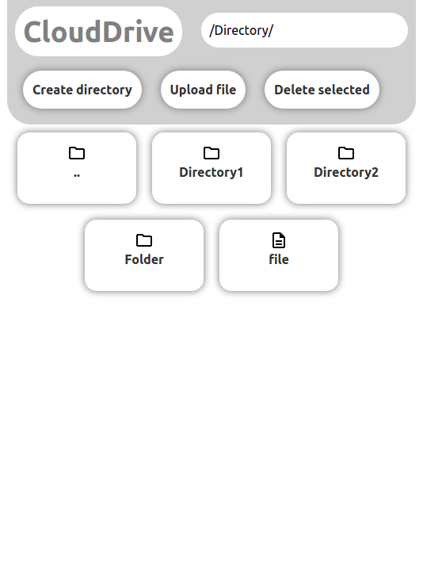

# CloudDrive

### A simple (yet powerful) web file server

## Preview

## Table of contents
* [Installation and configuration](#installation-and-configuration)
* [Documentation](#documentation)
    * [Client documentation](#client-documentation)
    * [Server documentation](#server-documentation)
    * [Upload process](#upload-process)

## Installation and configuration
1- Clone this repository on the machine that will run the server. 

2- NPM is a dependency for the app to run, so install it. For example, on Debian-based OSes: `(sudo) apt install npm`.

3- This repository contains a base start script (`start.sh.example`). Copy it to the file `start.sh` (or any other name you wish, but keep in mind that `start.sh` will be ignored by Git by default. For simplicity, the documentation will always use the name `start.sh`). Then, edit its contents as follows:
* Set the exported variable CLOUDDRIVE_PORT to the desired port (or leave it on the default value).
* Set the exported variable CLOUDDRIVE_STORAGE to the directory that will act as root for the storage.
* Set the exported variable CLOUDDRIVE_TEMP_STORAGE to the directory that will hold the uploaded files temporarily until the upload is complete.

4- Once the variables are configured, it's time to run the app with the command `./start.sh`. This will install the needed dependencies with `npm` and run the app on the specified port (make sure that the script has execution permissions (`chmod +x ./start.sh`)).

5- The server should now be running if nothing went wrong. Verify it by accessing to `http://localhost:CLOUDDRIVE_PORT` (replace CLOUDDRIVE_PORT with the port set on the configuration).

## Documentation

### Glossary:
* File -> File with uppercase 'F' in the documentation will usually refer to files and directories, not only files.
* Handlers -> Handlers' job is to manage different app behaviour and functionalities.

Both the client and the server are written in JavaScript. The client is loaded by the server as a static dependency, so there is no need to do specific client configurations.

### Client documentation
As said above, the client is written in JavaScript, along with Bootstrap for various styles and dialogs.

* File structure:
    * index.html -> Contains the HTML content of the web, such as dialogs and containers.
    * assets:
        * js -> Contains the JavaScript components (except Bootstrap).
        * img -> Contains the images, such as icons.
        * bootstrap -> Contains the Bootstrap-specific files.
        * css -> Contains the style sheets of the app.

* JavaScript component structure:
    * main.js -> This is the JavaScript file whose job is to initialize the different components such as the session handler or the delete queue. It also configures different buttons.
    * components -> Contains the different classes that do different jobs:
        * DeleteQueue -> The job of this class is to get files registered into a queue that will be processed once requested, sending requests to the server to delete the specific files and directories.
        * FileItem -> This class will initialize a button with a file or directory icon, depending on what the File is. This class can be registered in the session handler for other components to interact with the different File buttons.
        * MaterialButton -> Base class for the FileItem.
        * SessionHandler -> This class' job is to manage client-server interaction, contains some variables to act as context for other components, generates the FileItems based on the server's response in a infinite loop so the contents of the client are always up-to-date with the server's contents. This class also manages the active directory and allows to move between the different directories.
        * UploadHandler -> This class's job is to show a dialog to upload a single file, and upload the file to the server in chunks, which the server will use to reconstruct the file. More information about the upload process at the [Upload process](#upload-process) section.

### Server documentation
The server structure is the following:
* server.js: reads the environment variables for configuration and loads the different routes.
* Routes:
    * /delete: this route will delete the given [path](#server-paths).
    * /download: this route will serve the file that its written after the route. For example, `http://localhost:3333/download/file.zip` will download the file.txt at the root of the server storage.
    * /move: this route will move the given origin path to the given target path.
    * /upload: this route will receive file chunks for reconstructing the given file.
    * /mkdir: this route will create the given directory.
    * /readdir: this route will return the list of Files under a directory.

### Server paths
The server accepts paths in multiple routes for performing different actions. Those paths will be appended to the configured root for the storage, and the paths must not point outside that root.

### Upload process
The upload is performed as follows:
* A file is selected and once the upload button is clicked, the UploadHandler will split the file in chunks of 50MB.
* After the file is splitted, the UploadHandler will send each chunk to the server, whose job is to reconstruct the file with the chunks, by appending each chunk to the original chunk.
* This has been done because of some hosting services that have limits on POST requests sizes, this way the size limit can be configured to avoid issues.
